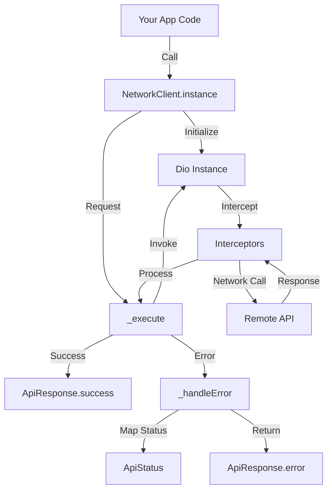

# Network Kit

A robust, singleton-based network client for Flutter applications, built on top of [Dio](https://pub.dev/packages/dio). This package simplifies API interactions by providing a centralized configuration, standardized response handling, and powerful interceptor support.

## Features

-   🚀 **Singleton Architecture**: Ensure a single, consistent network configuration throughout your app.
-   🛠️ **Easy Initialization**: Configure base URL, timeouts, and headers in one place.
-   🛡️ **Centralized Error Handling**: Automatically map Dio exceptions and HTTP status codes to a clean `ApiStatus` enum.
-   📦 **Standardized Response**: All API calls return a uniform `ApiResponse<T>` wrapper.
-   🔌 **Interceptor Support**: Easily inject custom logic for requests, responses, and errors.
-   📂 **File Support**: Built-in methods for Multipart uploads and file downloads.
-   📝 **Logging**: Integrated logging for debug builds.

## Architecture

The `NetworkClient` acts as a wrapper around the Dio HTTP client, enforcing a consistent pattern for all network requests.



## Flow

1.  **Initialization**: Call `NetworkClient.instance.init()` once at app startup via `main.dart` or your dependency injection setup.
2.  **Request**: Call methods like `.get()`, `.post()`. The client validates initialization and prepares the Dio request.
3.  **Execution**: The internal `_execute` method wraps the Dio call in a try-catch block to handle exceptions uniformly.
4.  **Interceptors**: Custom logic (e.g., adding Auth tokens) runs before the request is sent via `NetworkInterceptorConfig`.
5.  **Handling**:
    *   **Success**: Response data is parsed (optional `fromJson` callback) and wrapped in `ApiResponse.success`.
    *   **Error**: Exceptions (DioError, SocketException) are caught and mapped to user-friendly `ApiStatus` (e.g., `noInternet`, `timeout`, `unauthorized`) via `ApiResponse.error`.

## Getting started

Add the package to your `pubspec.yaml`:

```yaml
dependencies:
  network_kit: ^0.0.1
```

## Usage

### 1. Initialization

Initialize the client in your `main.dart` or startup logic.

```dart
import 'package:network_kit/network_kit.dart';

void main() {
  NetworkClient.instance.init(
    baseUrl: 'https://api.example.com',
    connectTimeout: const Duration(seconds: 15),
    interceptorConfig: NetworkInterceptorConfig(
      onRequest: (options, handler) {
        // Add auth token dynamically
        options.headers['Authorization'] = 'Bearer <token>';
        handler.next(options);
      },
      onError: (error, handler) {
        // Global error logging
        print('Global Error: ${error.message}');
        handler.next(error);
      }
    ),
  );
  runApp(MyApp());
}
```

### 2. Making Requests

#### GET Request with Type Parsing

```dart
Future<void> fetchUser(String userId) async {
  final response = await NetworkClient.instance.get<User>(
    '/users/$userId',
    fromJson: (json) => User.fromJson(json),
  );

  if (response.isSuccess) {
    print('User: ${response.data?.name}');
  } else {
    print('Error: ${response.message}');
  }
}
```

#### POST Request

```dart
Future<void> createUser(Map<String, dynamic> userData) async {
  final response = await NetworkClient.instance.post(
    '/users',
    data: userData,
  );

  if (response.status == ApiStatus.created) {
    print('User created successfully!');
  }
}
```

#### Multipart Upload

```dart
Future<void> uploadAvatar(String filePath) async {
  final formData = FormData.fromMap({
    'file': await MultipartFile.fromFile(filePath),
  });

  final response = await NetworkClient.instance.uploadMultipart(
    '/users/avatar',
    formData: formData,
  );
}
```

### 3. Error Handling

The package provides an `ApiStatus` enum to handle errors gracefully without try-catch blocks in your UI code.

```dart
if (response.status == ApiStatus.noInternet) {
  showNoInternetDialog();
} else if (response.status == ApiStatus.unauthorized) {
  redirectToLogin();
} else {
  showError(response.message ?? 'Something went wrong');
}
```

## API Reference

### `ApiStatus`

Common statuses include:
- `success` (200), `created` (201)
- `badRequest` (400), `unauthorized` (401), `forbidden` (403), `notFound` (404)
- `internalServerError` (500)
- `noInternet`, `timeout`, `unknown`

### `ApiResponse<T>`

Wrapper ensuring consistent response structure:
- `data`: The parsed data (T).
- `status`: The `ApiStatus` enum.
- `message`: User-friendly message (parsed from backend or local default).
- `rawResponse`: The raw data if parsing fails or debugging is needed.
